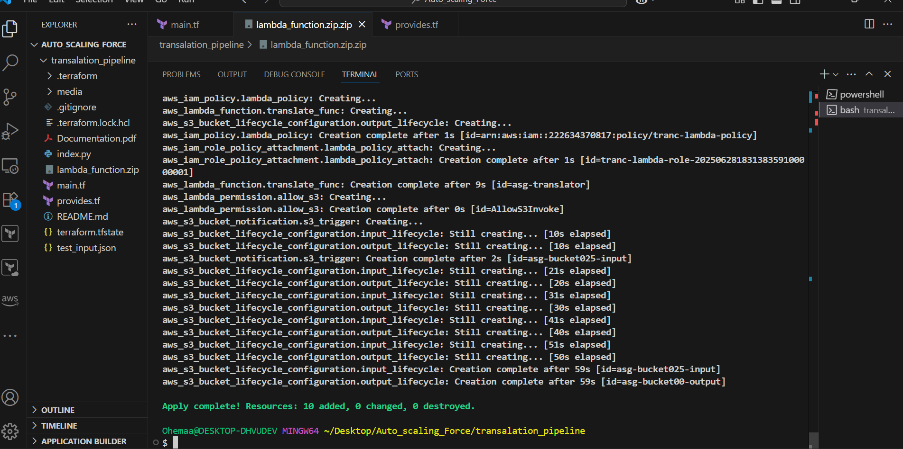
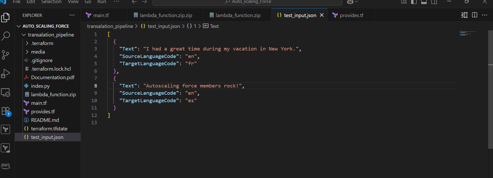
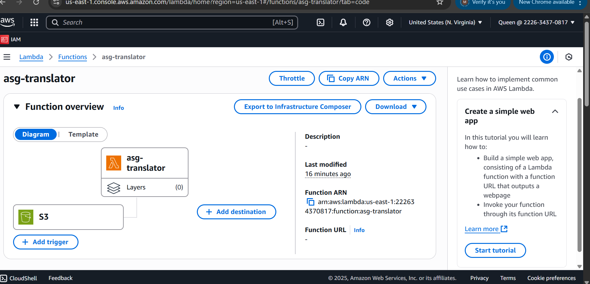
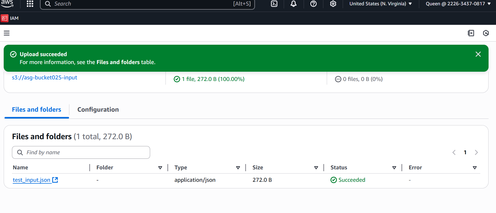
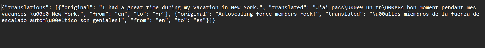
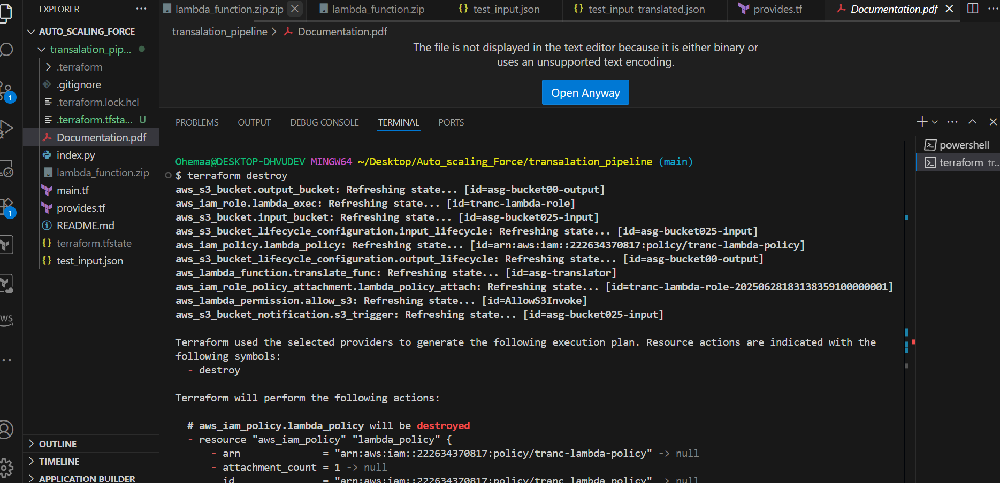

**PROJECT OVERVIEW**

> **TRANSLATION PIPELINE -- AWS TERRAFORM DEPLOYMENT**
>
> **This project automates the deployment of a serverless translation
> pipeline on AWS using Terraform. It leverages:**

- **Amazon S3 for storing input/output JSON files**

- **AWS Lambda (written in Python with Boto3) to process translation
  jobs**

- **Amazon Translate for automated language translation**

- **S3 Event Notifications to trigger Lambda execution on file upload**

- **Lifecycle Policies to manage bucket storage efficiently**

> **Key Features**

- **Fully Infrastructure-as-Code (IaC) using Terraform**

- **Lambda packaged as lambda_function.zip**

- **IAM roles and policies for secure service access**

- **Auto-triggered processing from S3 input bucket**

- **Translated output written back to a separate S3 bucket**

1.  **Terraform Apply -- Translation Pipeline**

This screenshot shows a successful terraform apply execution for the
translation_pipeline project.

**Resources Created**

- **IAM**: lambda_policy: Custom IAM policy for Lambda execution,
  translator role and policy attachment

- **Lambda**: translate Lambda function deployed from
  lambda_function.zip, Permission added to allow S3 to invoke the
  function.

- **S3**: Two buckets: bucket025-input and bucket00-output, Lifecycle
  rules created for both buckets, Notification configured to trigger
  Lambda on object creation.

<!-- -->

- Total resources deployed: **10 resources added**, **0 changed**, **0
  destroyed**, Lifecycle rule creation took \~59 seconds, Clean deploy
  with no errors.

{width="6.5in"
height="3.2381944444444444in"}

2.  JSON Input File for Amazon Translate

> **Overview**:\
> The screenshot shows a test_input.json file open in VS Code under the
> project *AUTO SCALING FORCE*. The file defines structured inputs for a
> translation task, including source and target languages and the text
> to be translated. The file is designed for use with **Amazon Translate
> and lambda**, supporting automated and event-driven translation
> workflows.
>
> {width="6.5in" height="2.35in"}

3.  AWS Lambda Function -- *asg-translator*\
    This screenshot shows the **AWS Lambda console** for the function
    named asg-translator. The function appears connected to an **S3
    trigger**, indicating it's event-driven, processing files uploaded
    to an S3 bucket.

{width="6.5in"
height="3.1333333333333333in"}

4.  S3 Upload Confirmation for test_input.json\
    This screenshot captures the **successful upload** of
    test_input.json to the S3 bucket asg-bucket205-input via the AWS
    Management Console. The file is recognized as a JSON object
    (application/json, 272.0 B) with a status of "Succeeded," confirming
    proper ingestion.

{width="6.5in"
height="2.8027777777777776in"}

5.  Output JSON from Amazon Translate via Lambda.\
    This JSON output shows translated results generated by a Lambda
    function integrating with **Amazon Translate**. Each entry logs the
    original English text, its translated counterpart, and the language
    pair used.

{width="6.5in" height="0.65625in"}

6.  Terraform Destroy Execution for AWS Translation.

This image captures the terminal output from running terraform destroy
within a VS Code workspace titled translation_pipeline. The command
initiates teardown of AWS infrastructure managed by Terraform. The plan
includes destroying the IAM policy, lambda_policy, confirming
Terraform's role in gracefully deprovisioning resources at the end of
the pipeline lifecycle.{width="6.5in"
height="3.14375in"}

AUTOSCALING GROUP MEMBERS:

Mary Mensah

Richard Acquah

Frimpong Osei

Precious Mmiba Tidogo

Robert Nyavor

Jeffrey Kwaku Osafo
